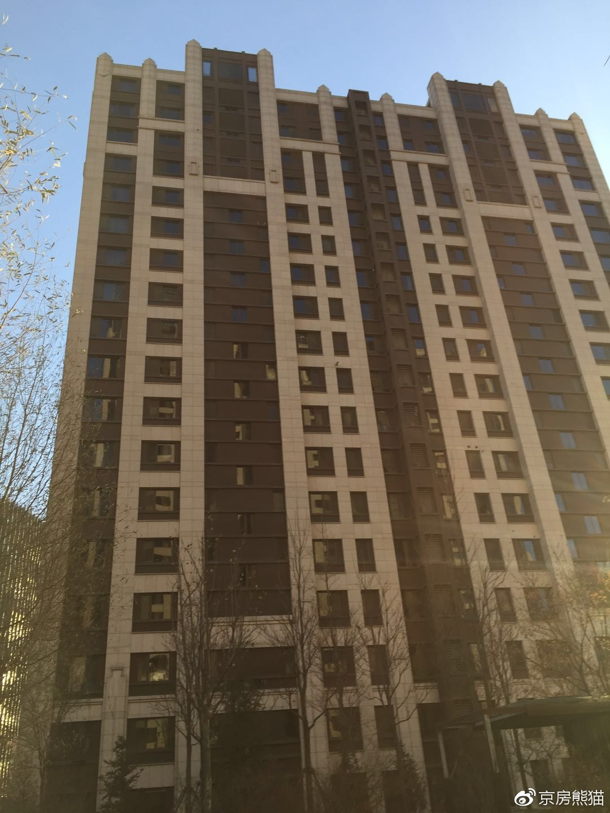
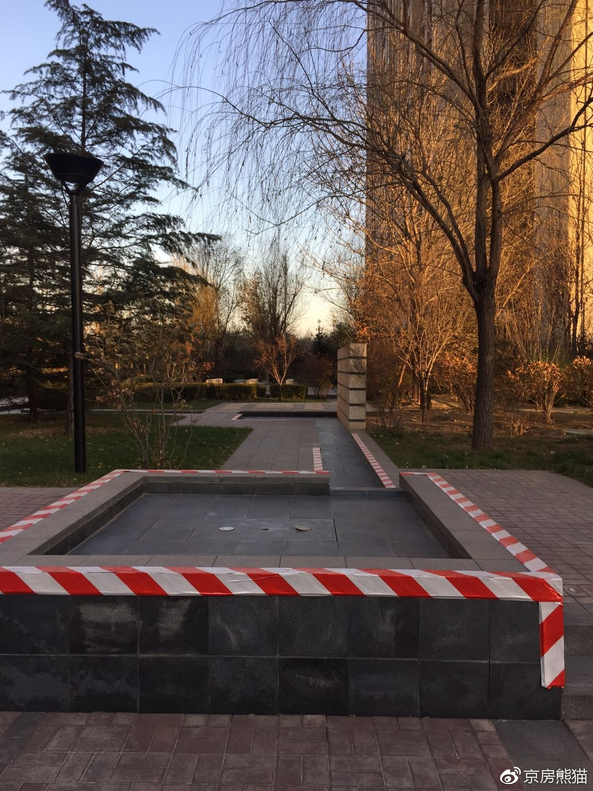

**简介**

保利中央公园，位于朝阳区望京东部，西边是融科，东边是大望京公园，北边是绿地中心，南边是保利国际广场，小区是2012-2014年由保利开发，物业保利自家物业，物业费3.42-5.5元，集中供暖，共10栋住宅，总共1183户，小区一共分为三期：一期艺林园2012年建成，2013年交房入住，二期嬉林园2013年建成，2014年交房入住，三期赏林苑2014年建成，2015年交房入住，全部精装修交房，小区东边是34万平米大望京公园，西边是新规划的城市景观公园，整个三期被绿化和公园所包围，一期前面还有一个待建的商场。交通：距离15号线望京东站710米（来自百度地图），附近学校有：北京市望京实验学校。

**楼栋分布**

一期：

13号楼 总高15层 共两个单元

14号楼 总高18层 共两个单元

15号楼 总高15层 共两个单元

16号楼 总高18层 共两个单元

二期：

9号楼 总高23层 共三个单元

10号楼 总高25层 共三个单元

三期：

2号楼 总高25层 共三个单元

3号楼 总高25层 共三个单元

4号楼 总高18层 共两个单元

5号楼 总高25层 共三个单元 

**户型介绍**

一期

主力户型

特殊户型

二期

三期

此户型图适用于三期 2.3.5号楼

此户型图适用于三期 4号楼

**总结：**

保利中央公园，小区新，物业管理好，设计的户型都不差，保利的超大面积赠送，小区的得房率是非常高的，基本上能达到95%，两居可做三居，三居可做四居，所以小区的单价是比较高，同样的134平的三居可以和东湖湾178平的户型相互对比，价格也接近，高端人群可以都去看看啊，小区缺点还是没有好学校，三期面积不错，二期的小区小了点，周边还在建设，所以看房的时候周边还是乱糟糟的，另外，户型基本上没有设计阳台。

**小区实拍**

一期

二期

三期

