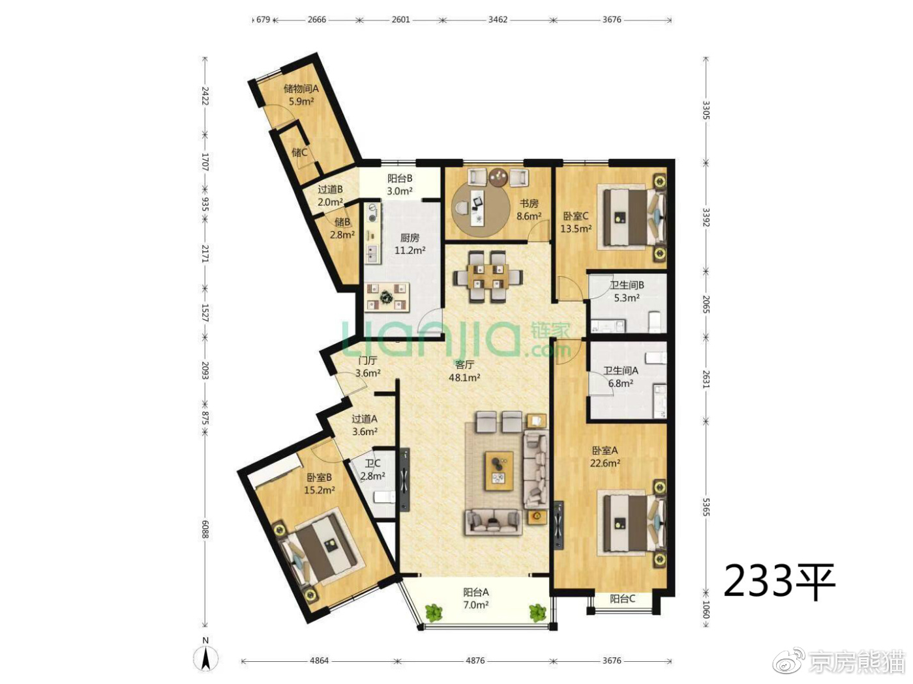
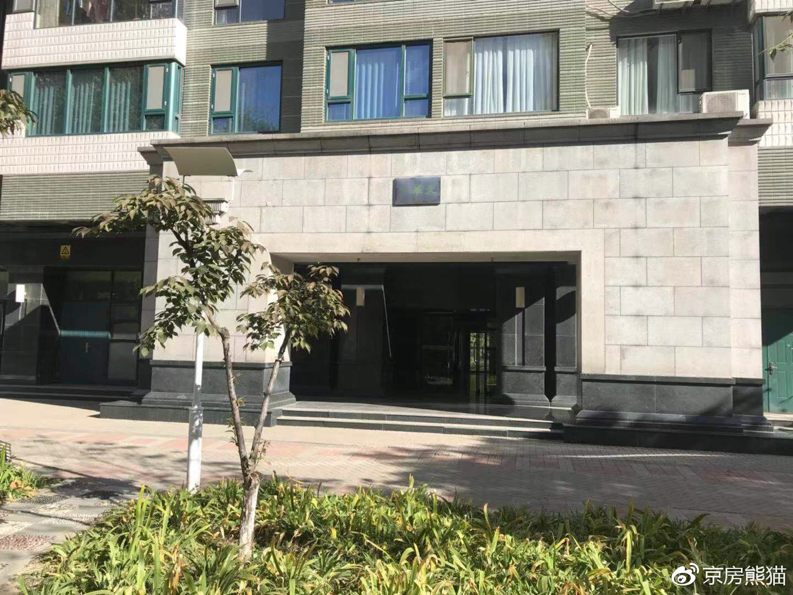

# 华鼎世家

华鼎世家，位于东北四环到五环之间 ，属于朝阳的望京望京商圈，位于望京阜通西大街与阜荣街交汇处。2002-2004年由首开集团开发，东南角为望京地标性建筑望京SOHO，西侧是望京凯悦酒店和首开广场写字楼，东北侧为望京的华联和凯德茂购物商场。周边还有奔驰北京总部和为人总部等大型写字楼。

**交通配套：**出小区A门距离367米就是14号线地铁站阜通站，出小区北门就是公交车望京西园四区站，有多趟公交车途径，有538路、运通104路、467路、471路等。

**商业配套：**小区往南就是望京最繁华的望京商业中心一整条的商业街，西南就是望京新世界大型商场，西北400米就是望京华联凯德茂，小区北侧800米是望京益和便民市场。

**教育资源：**林怡育儿幼儿园、白家庄小学、首都师范大学附属中学。

楼栋分布：
-----

小区一共6栋板楼，三个花园，绿化率高达35%，总高14层，低密度，花园水系，小区内部人车分流。

户型介绍
----

两户户型

三居户型

四居

五居

总结：
---

小区位于望京的核心区域，南侧凯德mall，为小区业主带来生活便利，购物方便;小区内部绿化很好，小溪流水，二期中央的月牙泉，环境优美，小区东侧的望京伯爵城中央公园，北侧是SOHO，在望京上班或者是在商务中心上班步行可达， 小区户型偏大，最小户型是122平南向两居，入门级别很高，以大户型为主，户型设计敞亮，但也不属于现在审美标准，另外首开的物业，就呵呵了。

小区实拍：
------

