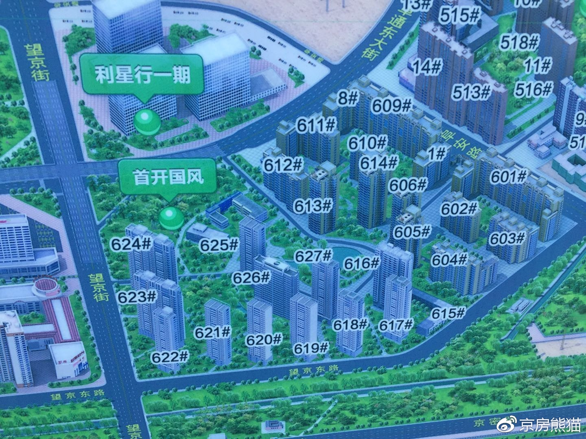
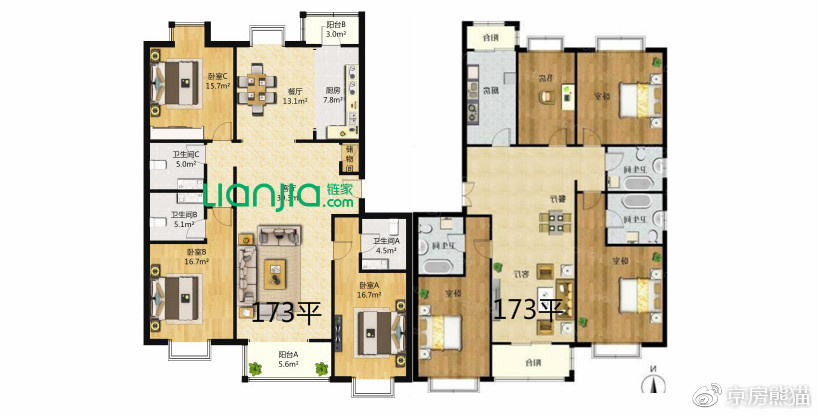

# 首开国风北京和国风上观

**简介**

国风北京、上观，位于东北四环到五环之间，属于朝阳望京板块，是首开开发，其中，国风北京是2006年，国风上观是2009年，小区内部共分为24栋住宅楼，外部三栋一栋为望京街道办事处，一栋为首开集团办事处，一栋为社区配套幼儿园，小区内部有2.2公里橡胶跑道，13200平的山丘花园，5000平米人工月牙湖，小区车位充足，售价30-32万，租金600-700元每月，自采暖可随意调节供暖时间。

配套：大望京公园，物美超市，星美影城，新荟城，SOHO。

交通：开车上京密高速，或者上四环都比较方便，小区西门有公交站536路和538路，距离地铁14号

望京南864米。

教育：小区内部有启明双语幼儿园，小学有北京市望京实验学校

**楼栋分布**

**户型介绍**

北京

此户型使用601和609号楼， 两梯四户（主力户型）

此户型适用于603号楼，特殊户型，两梯三户。

此户型适用于601,603，609，611，拐角处， 南边户型是东西118平，东西两居

此户型适用于，603,602,610,611号楼 ，两梯三户，把边是明卫（主力户型）

此户型适用于605、 606、 613、 614号楼 ，两梯四户，总高22层。

此户型适用于604、612号楼，共3个单元，把边的是明卫中间是暗卫。总高14层，两梯两户，

（主力户型）

上观

此户型适用于619号楼 ，两梯三户，总高27层。

此户型适用于621、 622、 623、 624号楼 、主力户型 ，两梯三户，如果不把边，就不是明卫哦，

此户型适用于623号楼，174不是明卫， 两梯三户。

此户型适用于624号楼 ，174平不是明卫哦， 两梯三户，总高27层。

此户型适用于625、 626、 627号楼 。1层是特殊户型哦，两梯两户。

**总结：**

小区是首开大国企开发，物业也是首开的物业，户型还是不错，南向两居和融科橄榄城的可以作比较，但总体看来，三居室还是偏大，均在非普线之上，但总价并不会太高，小区的大花园和人工湖，园林设计都还是不错的， 但是 物业管理一般，对园林的维护和小区楼栋管理一半，而且开发商利用涂料作为外立面，感觉不太高档，上观外立面好看一些，学校也就解决了就学问题。

**小区实拍**

